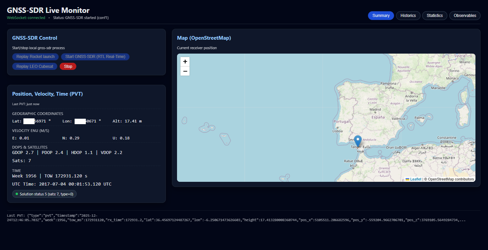
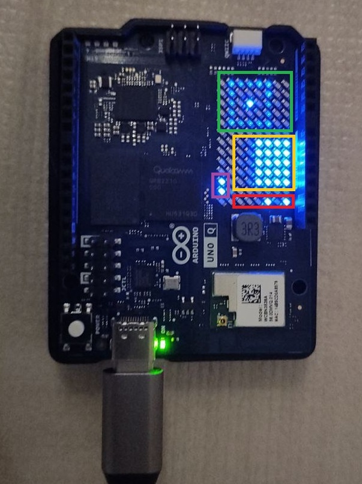

# GNSS-SDR real-time positioning on Arduino UNO Q  
### with integrated GNSS-SDR Web Monitor (Node.js)

This repository presents an embedded application of **GNSS-SDR** running in real time on the **Arduino UNO Q** platform. The system demonstrates GPS positioning using a compact, low-power Linux device, combined with web-based control and embedded visualization.

---

## Overview

The **Arduino UNO Q** runs a Debian-based Linux distribution, which enables native installation of **GNU Radio** and **GNSS-SDR**. The complete GNSS-SDR software stack is built directly on the target following the official GNSS-SDR build and installation instructions provided by the GNSS-SDR project.

In its current configuration, the receiver supports **GPS L1 C/A only**. Multi-constellation operation (e.g., Galileo) is not yet enabled due to computational and memory constraints of the platform.

The system integrates:

- Real-time GNSS-SDR processing  
- A Node.js web server for remote control  
- A Python interface for data extraction  
- An STM32F0 microcontroller driving an LED matrix for live visualization  

---

## Hardware setup

The hardware configuration used in this project consists of:

- **Arduino UNO Q**  
  - Linux host (Debian-based)  
  - STM32F0 microcontroller  
- **RTL-SDR front-end**  
  - Nooelec NESDR SmarTee SDR  
- **Active GNSS antenna**  
- **LED matrix display** driven by the STM32F0 MCU  

**Figure 1 – Hardware setup of the GNSS-SDR application on Arduino UNO Q**


---

## System architecture

The application follows a modular architecture that separates GNSS processing, control, and visualization tasks.

**Figure 2 – High-level system architecture**


Main components:

- **GNSS-SDR** running on Linux, processing live RF samples  
- **Node.js web server** for starting/stopping the receiver and selecting configurations  
- **Python interface script** extracting GNSS-SDR outputs  
- **STM32F0 microcontroller** receiving navigation data and driving the LED matrix  

---

## GNSS processing configuration

Real-time GNSS processing is performed using the following configuration:

- **Constellation:** GPS  
- **Signal:** GPS L1 C/A  
- **Number of tracking channels:** 7  
- **Coherent integration time:** 4 ms  
- **Front-end:** RTL-SDR (live RF input)  

The receiver computes standard GNSS outputs in real time, including:

- GPS observables  
- Carrier-to-noise density ratio (**C/N₀**)  
- Position, Velocity, and Time (**PVT**) solution  

Galileo signal processing is currently not enabled due to platform resource limitations.

---

## Web-based control interface

A **Node.js-based web server** runs on the Linux side of the Arduino UNO Q and provides a browser-accessible interface to control GNSS-SDR execution.

The web interface allows the user to:

- Start and stop the GNSS-SDR receiver  
- Select between different GNSS-SDR configuration files  
  - Offline / post-processing configuration  
  - Real-time configuration using RTL-SDR  

Selected GNSS-SDR outputs (observables, C/N₀, and PVT) are exposed for monitoring and downstream processing.

**Figure 3 – Web interface for GNSS-SDR control**



### GNSS-SDR config path

The Node.js server resolves GNSS-SDR config files from an environment variable first, falling back to the current user's home directory:

```
GNSS_SDR_HOME=/home/arduino/gnss-sdr
```

If `GNSS_SDR_HOME` is not set, it defaults to `~/<user>/gnss-sdr` via the OS user home.

---

## Embedded LED matrix visualization

A dedicated **Python script** extracts relevant GNSS-SDR outputs and forwards them to the **STM32F0 microcontroller** on the Arduino UNO Q.

The microcontroller drives an **LED matrix display**, providing real-time visualization of receiver status and navigation parameters.

Currently visualized information includes:

- Satellite signal strength indicators (C/N₀)  
- Receiver activity and status  
- PVT-related information  

**Figure 4 – LED matrix visualization of C/N₀**


**Figure 5 – LED matrix visualization of PVT information**

The LED matrix provides a compact, color-coded visualization of key PVT parameters:

- **Red:** A binary clock indicating the number of tracked satellites. The most significant bit is the leftmost LED.
- **Purple:** A conventional PVT status indicator. It blinks when no solution is available, remains steadily lit at low intensity for a 2D fix, and steadily lit at higher intensity for a 3D fix.
- **Yellow:** C/N₀ bar indicators for up to seven satellites.
- **Green:** Position and velocity representation. Within this square, a dot moves in the corresponding direction of motion; its displacement increases or decreases proportionally with the platform’s speed.



A working video can be found in: https://youtu.be/a7ZrCYMQSxc
---

## Status and limitations

- GPS L1 C/A only  
- 7 tracking channels  
- Real-time operation validated  
- Galileo, OSNMA and multi-constellation support: **not yet enabled**  
- Quantitative performance metrics (DOP, accuracy):  

---

## Future work

Planned extensions include:

- Performance characterization (C/N₀ statistics, DOP, positioning accuracy)  
- CPU and memory optimization  
- Exploration of multi-constellation support  
- Enhanced web-based monitoring and visualization  
- Extended LED matrix display modes  

---

## License

This work is released under the **GNU General Public License v2.0 (GPL-2.0)**.

The GPL license ensures practical usability, inspection, and continuous improvement by the research community, allowing discussion based on tangible code and the analysis of results obtained with real signals.

In summary:

- Copies may be distributed free of charge or commercially, provided the corresponding source code is made available under GPL-2.0.
- The licensed material may be studied and modified.
- Modified versions must remain under GPL-2.0 **if distributed**; there is no obligation to distribute modifications.
- GNSS-SDR–based software cannot be redistributed under proprietary or non-disclosure licenses.
- Hardware devices running this software may be sold; if the software is distributed, it must remain GPL-licensed.

See the `LICENSE` file for the full license text.
